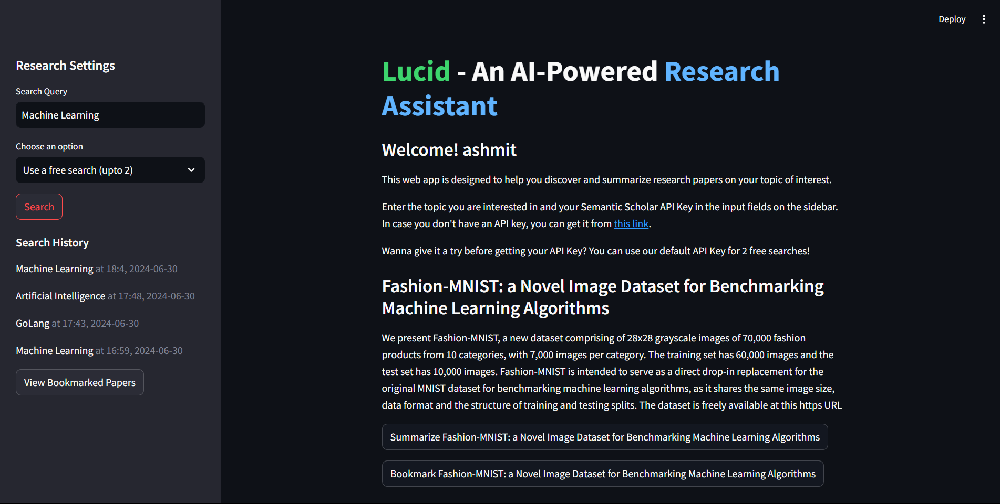

# Lucid - An AI Powered Research Assistant

Lucid is built using Streamlit, and powered by Meta's BART (Bi-directional and Auto-Regressive Transformers) model. The BART-Large-CNN model used for this project is especially fine-tuned for summarization tasks.

## Usage

Enter your topic of interest in the "Search Query" field on the sidebar and your Semantic Scholar API key below it. If you want to try out the app first, you can use our default API key for **2 free searches** before getting your own API. Just select "Use a free search" option and click on the Search button. 

Thats it! You would now see a summary of multiple research papers fetched from Semantic Scholar. You can also click on "Read more" to visit the original webpage of that paper.



## Features

- User authentication using MongoDB
- Semantic Scholar API integration
- Utilises BART Model for summarization tasks
- Stores search history

## Run the app

Clone the repository on your PC.
```
git clone https://github.com/ashmit0920/Lucid.git
```
Install the required packages.
```
pip install -r requirements.txt
```
Create a .env file and add your Semantic Scholar API Key and MongoDB URI.
```
SEMANTIC_API_KEY='your-api-key'
MONGO_URI='your-mongodb-connection-string'
```
Run the app.
```
streamlit run app.py
```

## Run using Docker

After creating the .env file, build the docker image.
```
docker build -t Lucid .
```

Run the docker container.
```
docker run -p 8501:8501 Lucid
```

## Future Updates

- Caching using Redis for optimization
- Add search history based recommendations
- User profiles
- Persistent storage for recording free searches